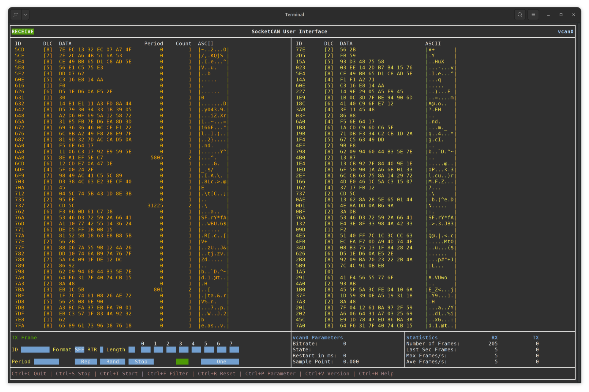

# SocketCAN User Interface for the Terminal - socanui

<p align="center">

</p>


## Features

- Send and Receive CAN Message
- CAN Frame List
- CAN Frame Table
- Show CAN Interface Parameter
- CAN Statistics
- Send CAN Frames (single, repeated, random)
  
## Usage

Just run `socanui can0` in your terminal and the UI will start. 


## Install

Grab an executable from the [release tab](https://github.com/miwagner/socanui/releases)

... or build it

```sh
go get github.com/miwagner/socanui/
```
## Socket CAN

You can create a virtual CAN interface if you don't have a physical CAN adapter:
```sh
sudo modprobe vcan
sudo ip link add dev vcan0 type vcan
sudo ip link set up vcan0
```